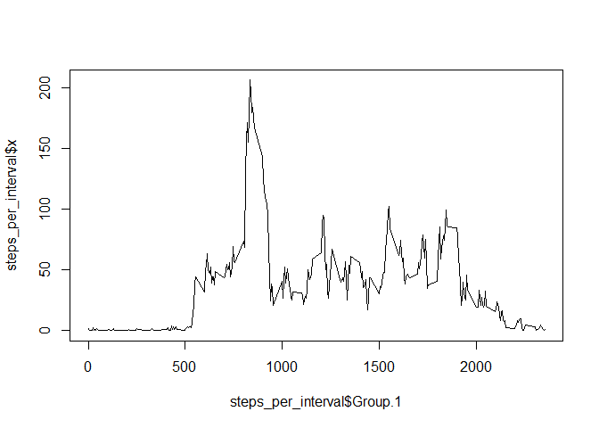
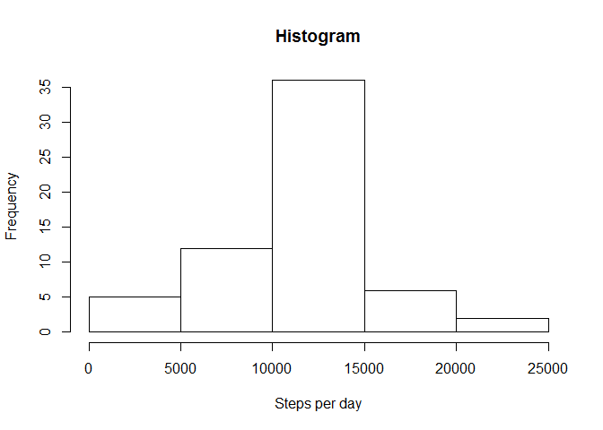
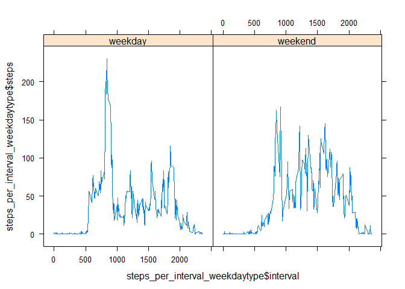

# Reproducible Research: Peer Assessment 1


## Loading and preprocessing the data

### Load the data (i.e. read.csv())


```r
activity<-read.csv(file = "activity.csv")
```

### Preprocess the data


```r
activity$date<-as.Date(activity$date)
```


## What is mean total number of steps taken per day?

### remove/ignore the missing values in the dataset


```r
activity_complete<-activity[complete.cases(activity),]
```

### Calculate the total number of steps taken per day


```r
steps_per_day<-aggregate(activity_complete[, 1], list(activity_complete$date), sum)
```

### Make a histogram of the total number of steps taken each day


```r
hist(steps_per_day$x,xlab = "Steps per day",main = "Histogram")
```

 

### Calculate and report the mean and median of the total number of steps taken per day


```r
mean(steps_per_day$x)
```

```
## [1] 10766.19
```

```r
median(steps_per_day$x)
```

```
## [1] 10765
```


## What is the average daily activity pattern?

### Make a time series plot of the 5-minute interval and the average number of steps taken, averaged across all days


```r
steps_per_interval<-aggregate(activity_complete[, 1], list(activity_complete$interval), mean)

plot(x = steps_per_interval$Group.1,y=steps_per_interval$x,type = "l")
```

 


### Which 5-minute interval, on average across all the days in the dataset, contains the maximum number of steps?


```r
steps_per_interval[which.max(steps_per_interval$x),1]
```

```
## [1] 835
```

## Imputing missing values

### Calculate and report the total number of missing values in the dataset (i.e. the total number of rows with NAs)


```r
sum(!complete.cases(activity))
```

```
## [1] 2304
```

### fill in all of the missing values in the dataset: use the mean for that that 5-minute interval, create a new dataset that is equal to the original dataset but with the missing data filled in.


```r
activity_na_filled <- activity
for (i in 1:nrow(activity_na_filled))
{
  if (is.na(activity_na_filled[i,1]))
    {
  activity_na_filled[i,1] <- steps_per_interval[steps_per_interval$Group.1==activity_na_filled[i,3] ,2]
    }
}
```

### Make a histogram of the total number of steps taken each day and Calculate and report the mean and median total number of steps taken per day.

Again - Calculate the total number of steps taken per day


```r
steps_per_day_clean<-aggregate(activity_na_filled[, 1], list(activity_na_filled$date), sum)
```

Again - Make a histogram of the total number of steps taken each day


```r
hist(steps_per_day_clean$x,xlab = "Steps per day",main = "Histogram")
```

 

Again - Calculate and report the mean and median of the total number of steps taken per day


```r
mean(steps_per_day_clean$x)
```

```
## [1] 10766.19
```

```r
median(steps_per_day_clean$x)
```

```
## [1] 10766.19
```


## Are there differences in activity patterns between weekdays and weekends? -> panel plot


```r
library("chron")
```

```
## Warning: package 'chron' was built under R version 3.2.1
```

```r
activity_na_filled$weekend = chron::is.weekend(activity_na_filled$date)
activity_na_filled$weekdaytype <- factor(ifelse(activity_na_filled$weekend,"weekend","weekday"))

library(dplyr)
```

```
## 
## Attaching package: 'dplyr'
## 
## The following object is masked from 'package:stats':
## 
##     filter
## 
## The following objects are masked from 'package:base':
## 
##     intersect, setdiff, setequal, union
```

```r
steps_per_interval_weekdaytype<- activity_na_filled %>%
  group_by(interval,weekdaytype) %>%
  summarise_each(funs(mean(., na.rm=TRUE)),-date, -weekend)

library("lattice") 
xyplot(steps_per_interval_weekdaytype$steps~steps_per_interval_weekdaytype$interval|steps_per_interval_weekdaytype$weekdaytype,type = "l")
```

 
